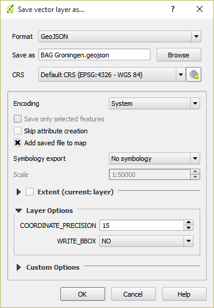

#############
Handleidingen
#############

*************************
Coördinatentransformaties
*************************

Op de desktop: QGIS
===================

1. Klik met de rechtermuisknop op de laag die je wilt transformeren en selecteer ``Save As..``
2. Kies ESRI Shapefile, GeoJSON of KML uit het ``Format`` menu
3. Klik op de ``Browse`` knop en geef aan waar het bestand opgeslagen moet worden
4. Kies ``EPSG:4326 - WGS84`` uit het ``CRS`` menu om de coordinaten naar ``lat/lng`` te transformeren
5. Klik op ``OK``

In de browser: proj4js
======================

`proj4js <http://proj4js.org/>`_ is een JavaScript bibliotheek voor het transformeren van coördinaten. 

.. code-block:: javascript

    // definitie van de Nederlandse coordinatenstelsel
    var RD = "+proj=sterea +lat_0=52.15616055555555 +lon_0=5.38763888888889 +k=0.9999079 +x_0=155000 +y_0=463000 +ellps=bessel +units=m +towgs84=565.2369,50.0087,465.658,-0.406857330322398,0.350732676542563,-1.8703473836068,4.0812 +no_defs";

    // World Geodetic System, in gebruik door Google Maps, Mapbox, CartoDB, e.a.
    var WGS84 = "WGS84";
    
    var transformed = proj4(RD,WGS84,[0,0]);
    // Array [ 3.3135577051498664, 47.974765849805124 ]
    

In de terminal: ogr2ogr
=======================

******************
WFS 2.0 pagination
******************
.. NOTE:: Dit is een `bijdrage <http://www.brentjensgeoict.nl/index.php?post=haal-meer-data-en-geojson-uit-een-pdok-wfs>`_ van Thijs Brentjens.

De Web Feature Services van PDOK bieden toegang tot allerlei (vector)data. De data van de BAG, natura2000, het NWB wegennet, bestuurlijke grenzen en wat dan ook kan je ophalen voor gebruik in eigen applicaties. Bijvoorbeeld in QGIS, OpenLayers of andere tooling. Voor de service URLs kan je kijken op de PDOK `services <https://www.pdok.nl/nl/producten/pdok-services>`_ pagina.

Conform de WFS specificatie gaat het ophalen met GetFeature requests. Bijvoorbeeld een HTTP Get Request om `alle provincie grenzen op te halen <http://geodata.nationaalgeoregister.nl/bestuurlijkegrenzen/wfs?service=WFS&version=2.0.0&request=GetFeature&typename=provincies>`_:

::

    http://geodata.nationaalgeoregister.nl/bestuurlijkegrenzen/wfs?
    service=WFS&
    version=2.0.0&
    request=GetFeature&
    typename=provincies

De PDOK services kennen alleen een maximum van 15.000 objecten per request. Dat mag, bijvoorbeeld om de belasting op de servers te beperken en te voorkomen dat iemand niet (per ongeluk) alle data ophaalt in zijn browser. Voor datasets van enige omvang betekent dit alleen dat je die niet helemaal in één keer via de WFS kan ophalen. In sommige gevallen kan je je wenden tot de data dumps, te downloaden via ATOM feeds. Zie `<http://geodata.nationaalgeoregister.nl/atom/index.xml>`_

Maar niet altijd. En soms wil je juist de WFS bevragen, met een filter erbij bijvoorbeeld. Dus wat doe je dan als je meer dan die 15.000 objecten wil ophalen? Dan komt een van de handige WFS 2.0.0 functies van pas: ResponsePaging.

WFS 2.0 ResponsePaging
======================

Vanaf versie 2.0.0 van WFS is ResponsePaging gespecificeerd. De PDOK WFSen ondersteunen dit. Gelukkig. Want met Response paging kan je een door jezelf opgegeven aantal objecten ophalen (bijvoorbeeld de eerste 100) en daarna de volgende set (van 100) en weer de volgende set, totdat je alles hebt. Vergelijkbaar met paginering van zoekresultaten van zoekmachines.

Dit kan je heel simpel opgeven per request met de paramaters *count* (die maxFeatures vervangt uit WFS 1.0.0 en WFS 1.1.0) en de *startIndex*. Een voorbeeld voor de eerste 100 ligplaatsen uit de BAG, dus met *count=100* en *startIndex=0*:

::

    http://geodata.nationaalgeoregister.nl/bagviewer/wfs?
    service=WFS&
    version=2.0.0&
    request=GetFeature&
    typename=bagviewer:ligplaats&
    count=100&
    startindex=0

En de volgende 100 en weer 100:

::

    http://geodata.nationaalgeoregister.nl/bagviewer/wfs?
    service=WFS&
    version=2.0.0&
    request=GetFeature&
    typename=bagviewer:ligplaats&
    count=100&
    startindex=100

    http://geodata.nationaalgeoregister.nl/bagviewer/wfs?
    service=WFS&
    version=2.0.0&
    request=GetFeature&
    typename=bagviewer:ligplaats&
    count=100&
    startindex=200

Totdat je alle data binnen hebt. Hoe je weet dat je alles hebt? Kijk eens naar het GML response als je *count* en *startIndex* hebt gebruikt. In de eerste tag staat een attribuut *numberMatched*, dat aangeeft hoeveel resultaten er totaal zijn. Erg handig om te gebruiken in je algoritme om alles op te halen.

Of slimmer nog, vraag voordat je daadwerkelijk data gaat ophalen met *resulttype=hits* hoeveel objecten je GetFeature request zou opleveren. Bijvoorbeeld (let op: zonder count parameter!)

::

    http://geodata.nationaalgeoregister.nl/bagviewer/wfs?
    service=WFS&
    version=2.0.0&
    request=GetFeature&
    typename=bagviewer:ligplaats&
    resulttype=hits

In dit geval is het `antwoord <http://geodata.nationaalgeoregister.nl/bagviewer/wfs?service=WFS&version=2.0.0&request=GetFeature&typename=bagviewer:ligplaats&resulttype=hits>`_ 11757.

****************************
WFS - JSON als output format
****************************

GML is voor veel webontwikkelaars niet de eerste keus. JSON en GeoJSON voor geodata lijken de standaard te worden. Maar een WFS geeft standaard (keurig conform de specs) GML terug op een GetFeature reques. Wederom niet getreurd. Ook het GeoJSON formaat is beschikbaar bij de WFSen die PDOK aanbiedt. Gebruik daarvoor de parameter *outputformat=json* bij een GetFeature request en je krijgt GeoJSON terug. Voorbeeld:

::

    http://geodata.nationaalgeoregister.nl/bagviewer/wfs?
    service=WFS&
    version=2.0.0&
    request=GetFeature&
    typename=bagviewer:ligplaats&
    count=100&
    startindex=100&
    outputformat=json 
    
Tot slot: een PDOK WFS steunt nog meer formaten. Zie daarvoor het stukje XML over het outputFormat van het GetFeature-deel in uit de Capabilities van een WFS. Dit Capabilities document is op te vragen via bijvoorbeeld:

::

    http://geodata.nationaalgeoregister.nl/bagviewer/wfs
    service=WFS&
    request=GetCapabilities

****************************
WFS - coördinaten in lat/lng
****************************

Tip van Edward MacGillavry (Webmapper): voeg ``srsName=EPSG:4326`` parameter aan je WFS request toe om de coördinaten naar lat/lng (WGS84) te transformeren.