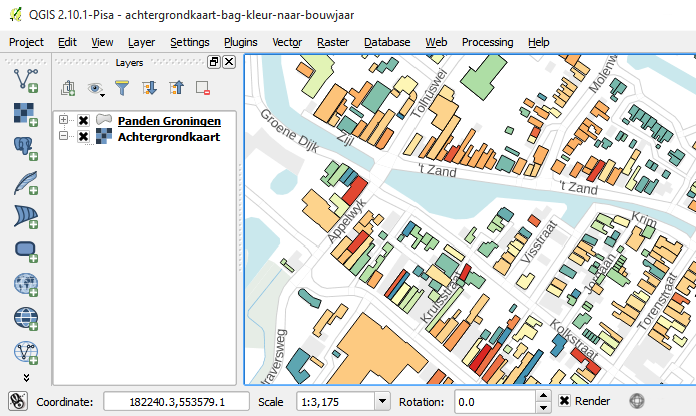
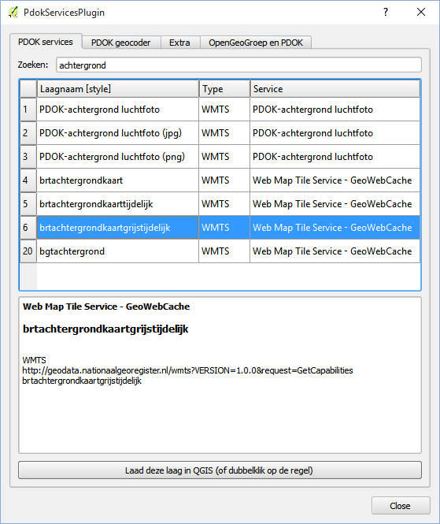

.. _PDOK: https://www.pdok.nl
.. _NGR: http://www.nationaalgeoregister.nl
.. _data.overheid.nl: https://data.overheid.nl/

######################
Maak een kaart met ...
######################

De webservices en APIs van PDOK, NGR, e.a. zijn op verschillende manieren te bekijken en downloaden. Deze pagina laat een aantal manieren zien.

**********
PDOK Kaart
**********

Met `PDOK Kaart <http://kaart.pdok.nl/>`_ kun je met een aantal klikken een eenvoudig kaartje maken met gegevens uit PDOK, NGR, de geo services van data.overheid.nl e.a. PDOK Kaart stelt je in staat om markers en lijnen te tekenen en van labels te voorzien of deze uit een kommagescheiden (CSV) of KML bestand te laden.

De gegenereerde PDOK Kaart kunt u opslaan en het bijv. mailen naar vrienden en collega's of embedden in uw blog, website, CMS, etc.

PDOK Kaart Wizard is uitermate geschikt voor het maken van eenvoudige kaartjes voor bijv. contactpagina's en routebeschrijving, of voor het visualiseren van basisregistraties en -datasets bijv. de Lange-afstandswandelroutes. 

.. raw:: html

    <iframe width="100%" height="350" frameborder="0" scrolling=no marginheight="0" marginwidth="0" src="http://kaart.pdok.nl/api/api.html?mapdiv=map_vialink&zoom=5&showlayerswitcher=false&loc=110030.88442944%2C%20477622.4327865&markersdef=http%3A%2F%2Fkaart.pdok.nl%2Fapi%2Fjs%2Fpdok-markers.js&layersdef=http%3A%2F%2Fkaart.pdok.nl%2Fapi%2Fjs%2Fpdok-layers.js&features=%3C%3Fxml%20version%3D%221.0%22%20encoding%3D%22UTF-8%22%3F%3E%3Ckml%20xmlns%3D%22http%3A%2F%2Fearth.google.com%2Fkml%2F2.2%22%3E%3CDocument%3E%3Cname%3Enull%3C%2Fname%3E%3Cdescription%3Enull%3C%2Fdescription%3E%3CStyle%20id%3D%22style_3630%22%3E%3CPolyStyle%3E%3Ccolor%3E3ffffff%3C%2Fcolor%3E%3Cfill%3E1%3C%2Ffill%3E%3C%2FPolyStyle%3E%3CIconStyle%3E%3CIcon%3E%3Chref%3Ehttp%3A%2F%2Fkaart.pdok.nl%2Fapi%2Fmarkertypes%2Fflag-2.png%3C%2Fhref%3E%3C%2FIcon%3E%3Cscale%3E1%3C%2Fscale%3E%3C%2FIconStyle%3E%3C%2FStyle%3E%3CStyle%20id%3D%22style_3632%22%3E%3CPolyStyle%3E%3Ccolor%3E3ffffff%3C%2Fcolor%3E%3Cfill%3E1%3C%2Ffill%3E%3C%2FPolyStyle%3E%3CIconStyle%3E%3CIcon%3E%3Chref%3Ehttp%3A%2F%2Fkaart.pdok.nl%2Fapi%2Fmarkertypes%2Fflag-red.png%3C%2Fhref%3E%3C%2FIcon%3E%3Cscale%3E1%3C%2Fscale%3E%3C%2FIconStyle%3E%3C%2FStyle%3E%3CFolder%3E%3CPlacemark%3E%3Cname%3E%26amp%3Bnbsp%3B%3C%2Fname%3E%3Cdescription%3E%26amp%3Bnbsp%3B%3C%2Fdescription%3E%3CstyleUrl%3E%23style_3630%3C%2FstyleUrl%3E%3CPoint%3E%3Ccoordinates%3E4.491184125629785%2C52.158895089421584%3C%2Fcoordinates%3E%3C%2FPoint%3E%3CExtendedData%3E%3CData%20name%3D%22styletype%22%3E%3Cvalue%3Emt6%3C%2Fvalue%3E%3C%2FData%3E%3C%2FExtendedData%3E%3C%2FPlacemark%3E%3CPlacemark%3E%3Cname%3E%26amp%3Bnbsp%3B%3C%2Fname%3E%3Cdescription%3E%26amp%3Bnbsp%3B%3C%2Fdescription%3E%3CstyleUrl%3E%23style_3632%3C%2FstyleUrl%3E%3CPoint%3E%3Ccoordinates%3E4.8930395951789585%2C52.372672703183845%3C%2Fcoordinates%3E%3C%2FPoint%3E%3CExtendedData%3E%3CData%20name%3D%22styletype%22%3E%3Cvalue%3Emt8%3C%2Fvalue%3E%3C%2FData%3E%3C%2FExtendedData%3E%3C%2FPlacemark%3E%3C%2FFolder%3E%3C%2FDocument%3E%3C%2Fkml%3E&baselayer=BRT&pdoklayers=BRT%2CLUFO%2CLAWROUTES" title="PDOK Kaart"></iframe>

Zie de PDOK Kaart `handleiding <http://pdokkaart.readthedocs.org/>`_ voor meer informatie.

.. _quickstart-leaflet:

*******
Leaflet
*******

De geo services en APIs van PDOK, NGR, data.overheid.nl, e.a. komen in twee smaken. De *view* services (:ref:`WMS <wms>`, :ref:`WMTS <wmts>` en :ref:`TMS <TMS>`) leveren statische kaarbeelden (PNG, JPG) en zijn geschikt voor het visualiseren van achtergrondkaarten. De *download* service - voluit: :ref:`OGC-WFS` - levert geografische vector data (GeoJSON, GML) en de bijbehorende administratieve gegevens.

De download service kunnen we gebruiken om bijv. 100 panden uit de `Basisregistratie Adressen en Gebouwen (BAG) <http://nationaalgeoregister.nl/geonetwork/srv/dut/search#|aa3b5e6e-7baa-40c0-8972-3353e927ec2f>`_ op een Leaflet kaart te tonen.

De URL van de BAG WFS API is::

    http://geodata.nationaalgeoregister.nl/bag/wfs

Deze vind je o.a. in het Nationaal GeoRegister door te zoeken naar ``BAG`` en te filtreren op ``Downloadbare data``. De eerste 100 gebouwen uit de BAG halen we middels een HTTP GET request op in combinatie met de volgende query parameters::

    service = WFS
    request = GetFeature
    typeName = bag:pand
    count = 100
    srsName = EPSG:4326
    outputFormat = json

Het `GeoJSON resultaat <http://geodata.nationaalgeoregister.nl/bag/wfs?service=WFS&request=GetFeature&typeName=bag:pand&count=10&outputFormat=json>`_ kun je bijv. in Leaflet `visualiseren <https://cdn.rawgit.com/ndkv/a9f903c1579ff7609638/raw/01e13989c298330715b8b59194bd1f6512ab475b/index.html>`_ m.b.v. van de ``L.geoJson()`` functie.

.. <iframe width="100%" height="250" frameborder="0" marginheight="0" marginwidth="0" src="https://cdn.rawgit.com/ndkv/a9f903c1579ff7609638/raw/01e13989c298330715b8b59194bd1f6512ab475b/index.html"></iframe>

.. raw:: html

    

Naast het ophalen van features ondersteunt de WFS API het toepassen van (ruimtelijke) filters en het uitvoeren van eenvoudige ruimtelijke analyses, zie de :ref:`WFS documentatie <OGC-WFS>` voor meer informatie.

****
QGIS
****

`QGIS <http://qgis.org/en/site/>`_ is een open source geografisch informatiesysteem (GIS) welk geografische gegevens kan visualiseren, bewerken en analyseren. QGIS ondersteunt de gangbare geo bestandsformaten zoals Shapefiles, KML, GML, GeoJSON, etc. en de :ref:`geo services en APIs <services>` van `PDOK`_ , `NGR`_, `data.overheid.nl`_, e.a. Gegevens kunnen gevisualiseerd, getransformeerd en gedownload worden zodat ze te gebruiken zijn in Mapbox, CartoDB, Google Maps/Earth, e.a.

PDOK/INSPIRE plugins - achtergrondkaart
==============================

De :ref:`PDOK en INSPIRE plugins <qgis-pdok-inspire-plugins>` geven snel en makkelijk toegang tot veel Nederlandse geodata.

Met de PDOK Services Plugin kun je eenvoudig door de geodata van `PDOK`_ zoeken. Installeer de plugin via het ``Plugins`` -> ``Manage and Install Plugins`` menu. Klik op het oranje ``+PDOK`` knopje links van het ``PDOK Geocoder`` veld om de beschikbare PDOK datasets te zien. Zoek op bijv. ``achtergrond`` om een lijst van de beschikbare achtergrondkaarten te zien.

WMS / WMTS - Actueel Hoogtebestand Nederland
============================================

Geodata is bechikbaar in een aantal smaken. *View* services bieden statische kaartbeelden aan, denk bijv. aan de `Google Static Maps API <https://developers.google.com/maps/documentation/static-maps/>`_. Ze zijn geschikt voor het tonen van achtergrondkaarten en landsdekkende datasets zoals de `Actueel Hoogtebestand Nederland <http://nationaalgeoregister.nl/geonetwork/srv/dut/search#|c00b2d04-1e54-41c6-9b87-c226798361c0>`_. Ga als volgt te werk om de AHN2 :ref:`view service <wms>` aan te spreken in QGIS.

1. In het hoofdmenu klik op ``Layer``-> ``Add Layer`` -> ``Add WMS / WMTS Layer``
2. Klik op ``New``
3. Vul een naam in in bij ``Name``
4. Plak de WMS URL (``http://geodata.nationaalgeoregister.nl/ahn2/wms?service=wms``) in het ``URL`` veld en klik op ``OK``
5. Klik op ``Connect``
6. Kies een van de lagen en klik op ``Add``

Klik op ``View`` -> ``Identify Features`` en klik op de kaart om de hoogte op te halen.

In :ref:`services` lees je meer over de verschillende *view* services. :ref:`webapps` laat zien hoe je *view* services in Leaflet en OpenLayers kan laden.

WFS - Zeer kwetsbare gebieden
=============================

*Download* services a.k.a. WFS leveren vector data als o.a. GeoJSON. Ga als volgt te werk om de :ref:`*download* service <services>` van bijv. de `Zeer kwetsbare gebieden <https://data.overheid.nl/data/dataset/zeer-kwetsbare-gebieden>`_) dataset aan te spreken in QGIS:

1. In het hoofdmenu klik op ``Layer``-> ``Add Layer`` -> ``Add WFS Layer``
2. Klik op ``New``
3. Vul een naam in in bij ``Name`` 
4. Plak de WFS URL (``http://ags101.prvgld.nl/arcgis/services/INSPIRE_ov/MapServer/WFSServer``) in het ``URL`` veld en klik op ``OK``
5. Klik op ``Connect``
6. Kies een van de lagen en klik op ``Add`` 
7. De gekozen laag verschijnt in de ``Layers`` pane
8. Klik met de rechtermuisknop op de laag en selecteer ``Zoom to layer``

In :ref:`wfs` lees je meer over de verschillende *view* services. :ref:`webapps` laat zien hoe je *download* services in Leaflet en OpenLayers kan laden. 

*******************
CartoDB (en Mapbox)
*******************

De Nederlandse geo services en APIs leveren, volgens de geldende standaarden, gegevens als Geography Markup Language (GML) in het Nederlandse Rijksdriehoekscoordinatenstelsel (RD). Om ze geschikt te maken voor Mapbox, CartoDB, Google Maps e.a. :ref:`dienen ze getransformeerd te worden <coord-trans>` naar Shapefiles/GeoJSON en het WGS84 coordinatenstelsel.

.. raw:: html

    <iframe width="100%" height="400" frameborder="0" src="https://simeon.cartodb.com/viz/f1f469ec-3b73-11e5-a93c-0e4fddd5de28/embed_map" allowfullscreen webkitallowfullscreen mozallowfullscreen oallowfullscreen msallowfullscreen></iframe>

QGIS
====

In QGIS gaat het downloaden en transformeren als volgt:

1. Klik met de rechtermuisknop op de WFS dataset die je wilt downloaden en transformeren en selecteer ``Save As..``
2. Kies ESRI Shapefile, GeoJSON of KML uit het ``Format`` menu
3. Kies ``EPSG:4326 - WGS84`` uit het ``CRS`` menu
4. Klik op ``OK``

.. image:: images/qgis-vector-save.png
    :align: center

Het nieuwe bestand kun je uploaden in CartoDB, gebruiken als databron in Mapbox Studio of visualiseren in Google Earth. 

ogr2ogr
=======

ogr2ogr is een *command line utility* waarmee gegevens uit een groot aantal bronnen gelezen en getransformeerd kunnen worden.

::

    ogr2ogr -f GeoJSON bag.geojson WFS:"http://geodata.nationaalgeoregister.nl/bagviewer/wfs" \
    -t_srs EPSG:4326 bagviewer:pand

Zie de :ref:`ogr2ogr handleiding <ogr2ogr tutorial>` voor meer informatie. 