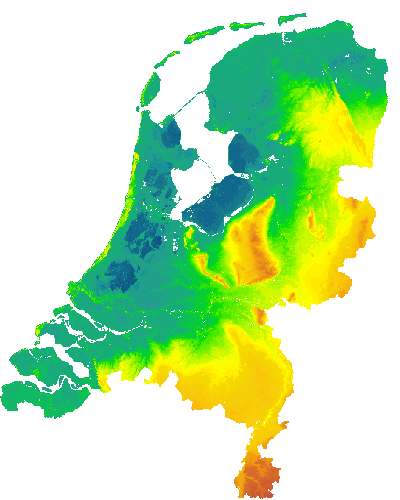
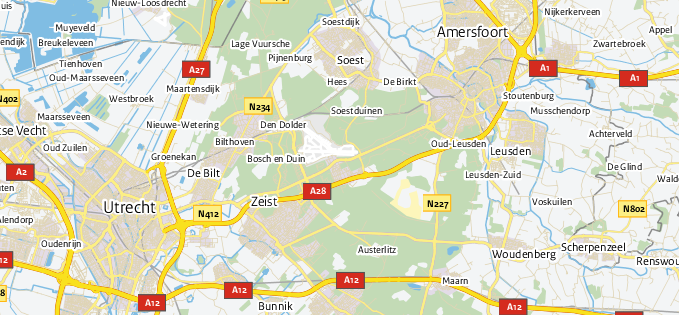
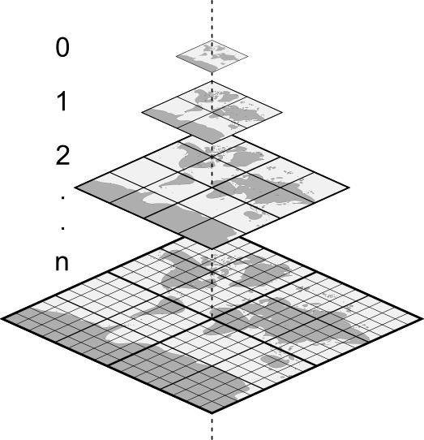
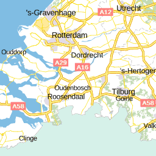
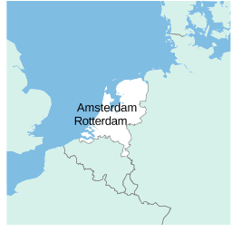
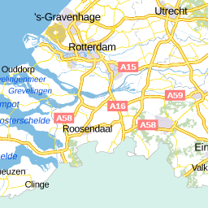

.. _CSW specificatie: http://www.opengeospatial.org/standards/cat

.. _services:

####################
Geo services en APIs
####################

De Nederlandse geo-infrastructuur ontsluit gegevens middels een aantal Open Geospatial Consortium (OGC) standaarden. De Open Geospatial Consortium (OGC) is een internationale organisatie die de leiding heeft in de ontwikkeling van interoperabele standaarden voor georuimtelijke en plaatsgebonden diensten. De belangrijkste OGC standaarden in gebruik in Nederland zijn de 

- de **Web Map Service** (WMS) - deze zogenaamde *view* service genereert een statische kaartuitsnedes van geo-informatie in een raster formaat zoals PNG, GIF of JPEG. 
- de **Web Feature Service** (WFS) - deze zogenaamde *download* service is een protocol voor het opvragen van geografische vector data en de daarbij behorende attributen, al dan niet via een ruimtelijk filter.

Elk W*S dienst heeft een URL die met HTTP GET en POST requests bevraagd wordt. De WMS `GetMap request <http://geodata.nationaalgeoregister.nl/ahn2/wms?service=wms&request=getmap&layers=ahn2_5m&bbox=13014,306243,286599,623492&width=400&height=500&format=image/png&srs=EPSG:28992>`_ haalt bijv. een kaartbeeld op.

De services ondersteunen een aantal requests waarmee het mogelijk is om kaartbeelden en vector data op te vragen, filters toe te passen en ruimtelijke analyses uit te voeren. 

De eigenschappen van een service zijn in de *Capabilities* document beschreven. De ``GetCapabitlies`` request haalt deze als volgt op::

    http://geo.data.nl/ogc-service?
    service=WMS/WFS/WMTS/WCS
    request=GetCapabilities

In de praktijk worden de services zelden direct bevraagd. Het is gebruikelijker om ze via bijv. OpenLayers, :ref:`Leaflet <quickstart-leaflet>`, QGIS, ogr2ogr, `Python <https://pypi.python.org/pypi/OWSLib>`_, etc. te benaderen.

**Het overgrote deel van de gegevens in het** `NGR <http://www.nationaalgeoregister.nl>`_ **is als WMS/WFS beschikbaar, evenals de** `landsdekkende datasets <https://www.pdok.nl/nl/producten/pdok-services/overzicht-urls>`_ **die door** `PDOK <https://www.pdok.nl>`_ **beheerd worden.**

W*S services en APIs worden ook aangeboden door `data.overheid.nl <https://data.overheid.nl>`_, `Atlas Leefomgeving <http://www.atlasleefomgeving.nl/>`_, `Geoportaal Waterschappen <http://waterschapservices.webgispublisher.nl/Choosemap.aspx>`_, `Ruimtelijkeplannen.nl <http://www.ruimtelijkeplannen.nl/web-roo/roo/?>`_ e.a.

De `GeoServer documentatie <http://docs.geoserver.org/latest/en/user/services/index.html>`_ geeft een uitgebreide en gedetailleerde beschrijving van de OGC geo services en APIs.

.. _wfs:
.. _OGC-WFS:

*************************
Web Feature Service (WFS)
*************************

De Web Feature Service is een webservice voor het opvragen van geografische vector data en de bijbehorende administratieve gegevens. De belangrijke requests zijn:

- **GetCapabilities**: voor het bekijken van de mogelijkheden van de service
- **DescribeFeatureType**: haalt de beschrijving op van een of meerdere objecten
- **GetFeature**: haalt een of meerdere geometrieeen en de bijbehorende attributen op. Deze operatie kan gecombineerd worden met ruimtelijke of attribuut filters en een output-formaat keuze (afhankelijk van implementatie: bijv. GML, SHP, JSON, KML, CSV)

Zie de `specificatie <http://www.opengeospatial.org/standards/wfs>`_ voor een volledige beschrijving van de WFS standaard. In de GeoServer `WFS documentatie <http://docs.geoserver.org/latest/en/user/services/wfs/index.html>`_ lees je in detail hoe je WFS endpoints kan bevragen. 

In :ref:`webapps` lees je hoe je WFS in Leaflet en OpenLayers aanspreekt.

GetCapabilities
===============

De functionaliteit van een WFS endpoint wordt beschreven in een *Capabilities* document die middels een GetCapabilities request opgehaald kan worden:

::

    http://geodata.nationaalgeoregister.nl/bag/wfs?
    service=WFS&
    request=GetCapabilities

`Resultaat <http://geodata.nationaalgeoregister.nl/bag/wfs?service=WFS&request=GetCapabilities>`_: een XML document waarin o.a. de opgeslagen data types, lagen beschreven worden, ondersteunde coordinatenstelsels, etc.

.. code-block:: xml

    <wfs:WFS_Capabilities version="2.0.0" xsi:schemaLocation="http://www.opengis.net/wfs/2.0 http://geodata.nationaalgeoregister.nl/schemas/wfs/2.0/wfs.xsd http://inspire.ec.europa.eu/schemas/common/1.0 http://inspire.ec.europa.eu/schemas/common/1.0/common.xsd http://inspire.ec.europa.eu/schemas/inspire_dls/1.0 http://inspire.ec.europa.eu/schemas/inspire_dls/1.0/inspire_dls.xsd" updateSequence="1943">
        <ows:ServiceIdentification>...</ows:ServiceIdentification>
        <ows:ServiceProvider>...</ows:ServiceProvider>
        <ows:OperationsMetadata>...</ows:OperationsMetadata>
        <FeatureTypeList>
            <FeatureType></FeatureType>
            <FeatureType>
                <Name>bag:pand</Name>
                <Title>pand</Title>
                <Abstract>pand</Abstract>
                <ows:Keywords>
                    <ows:Keyword>pand</ows:Keyword>
                    <ows:Keyword>features</ows:Keyword>
                </ows:Keywords>
                <DefaultCRS>urn:ogc:def:crs:EPSG::28992</DefaultCRS>
                <ows:WGS84BoundingBox>
                    <ows:LowerCorner>3.2800546964714012 50.748745396375774</ows:LowerCorner>
                    <ows:UpperCorner>7.224161199744223 53.48515806526503</ows:UpperCorner>
                </ows:WGS84BoundingBox>
                <MetadataURL xlink:href="http://www.nationaalgeoregister.nl/geonetwork/srv/dut/xml.metadata.get?uuid=aa3b5e6e-7baa-40c0-8972-3353e927ec2f"/>
            </FeatureType>
            <FeatureType>...</FeatureType>
            <FeatureType>...</FeatureType>
            <FeatureType>...</FeatureType>
        </FeatureTypeList>
        <fes:Filter_Capabilities>...</fes:Filter_Capabilities>
    </wfs:WFS_Capabilities>

Op de GeoServer `WFS GetCapabilities documentatiepagina <http://docs.geoserver.org/latest/en/user/services/wfs/reference.html#getcapabilities>`_ lees je meer over de componenten van de *Capabilities* document. 

GetFeature
==========

Met de GetFeature request is het mogelijk om geometrieen en attributen op te halen. De volgende reuest haalt 100 gebouwen op uit de Basisregistratie Adressen en Gebouwen

:: 

    http://geodata.nationaalgeoregister.nl/bag/wfs?
    service=WFS&
    request=GetFeature&
    typeName=bag:pand&
    count=100&
    outputFormat=json

`Resultaat <http://geodata.nationaalgeoregister.nl/bag/wfs?service=WFS&request=GetFeature&typeName=bag:pand&count=10&outputFormat=json>`_: een GeoJSON document met daarin de polygonen van de voetafdruk en attributen van elk gebouw.

.. code-block:: javascript

    {
        "type": "FeatureCollection",
        "features": [
            {
                "type": "Feature",
                "id": "pand.7871844",
                "geometry_name": "geometrie",
                "properties": {
                    "identificatie": 856100000350209,
                    "bouwjaar": 1941,
                    "status": "Pand in gebruik",
                    "gebruiksdoel": "woonfunctie",
                    "oppervlakte_min": 147,
                    "oppervlakte_max": 147,
                    "aantal_verblijfsobjecten": 1,
                    "actualiteitsdatum": null
                },
                "geometry": {
                    "type": "Polygon",
                    "coordinates": [
                        [
                            [
                                179753.466,
                                405278.319
                            ],
                            [
                                179750.226,
                                405277.631
                            ],

                            ...

                            [
                                179753.466,
                                405278.319
                            ]
                        ]
                    ]
                }
            },
            {...}
        ]
    }

Zie de GeoServer `WFS GetFeature documentatie <http://docs.geoserver.org/latest/en/user/services/wfs/reference.html#getfeature>`_ voor een volledige beschrijving van deze request.

.. _wms:
.. _OGC-WMS:
.. _OGC_WMS-1.1.1-http-get-map:

*********************
Web Map Service (WMS)
*********************

De Web Map Service is een webservice voor het ophalen van kaartbeelden in een raster formaat zoals PNG, JPEG en GIF. Het is te vergelijken met de *static maps* APIs van `Mapbox <https://www.mapbox.com/developers/api/static/>`_ en `Google Maps <https://developers.google.com/maps/documentation/staticmaps/#quick_example>`_ 

WMS kent minimaal 3 operaties: 

- **GetCapabilities**: retourneert een lijst van beschikbare kaartlagen, projecties, formaten, enz.
- **GetMap**: retourneert een statisch afbeelding van een kaart
- **GetFeatureInfo**: geeft attribuutgegevens van een object op een bepaalde plek op de kaart

Zie de `specificatie <http://www.opengeospatial.org/standards/wms>`_ voor een volledige beschrijving van WMS. In de `GeoSever documentatie <http://docs.geoserver.org/latest/en/user/services/wms/index.html>`_ lees je hoe je WMS concreet kan bevragen.

In :ref:`webapps` lees je hoe je WMS in Leaflet en OpenLayers aanspreekt.

GetCapabilities
===============

De functionaliteit van een WMS endpoint wordt beschreven in een *Capabilities* document die middels een GetCapabilities request opgehaald wordt:

::

    http://geodata.nationaalgeoregister.nl/ahn2/wms?
    service=WMS&
    request=GetCapabilities

`Resultaat <http://geodata.nationaalgeoregister.nl/ahn2/wms?service=WMS&request=GetCapabilities>`_: een XML document waarin o.a. de opgeslagen data types, lagen beschreven worden, ondersteunde coordinatenstelsels, etc.

.. code-block:: xml
    :linenos:

    <WMS_Capabilities xmlns="http://www.opengis.net/wms" xmlns:xlink="http://www.w3.org/1999/xlink" xmlns:xsi="http://www.w3.org/2001/XMLSchema-instance" version="1.3.0" updateSequence="1913" xsi:schemaLocation="http://www.opengis.net/wms http://geodata.nationaalgeoregister.nl/schemas/wms/1.3.0/capabilities_1_3_0.xsd">
    
    <Service>...</Service>
    <Capability>
        <Request>
            <GetCapabilities>...</GetCapabilities>
            <GetMap>...</GetMap>
            <GetFeatureInfo>...</GetFeatureInfo>
        </Request>
        <Exception>...</Exception>
        <Layer>
            <Title>Actueel Hoogtebestand Nederland 2</Title>
            <Abstract>Actueel Hoogtebestand Nederland 2</Abstract>
            <!-- Limited list of EPSG projections: -->
            <CRS>EPSG:25831</CRS>
            <CRS>EPSG:25832</CRS>
            <CRS>EPSG:28992</CRS>
            <CRS>EPSG:3034</CRS>
            <CRS>EPSG:3035</CRS>
            <CRS>EPSG:3857</CRS>
            <CRS>EPSG:4258</CRS>
            <CRS>EPSG:4326</CRS>
            <CRS>CRS:84</CRS>
            <EX_GeographicBoundingBox>...</EX_GeographicBoundingBox>
            <BoundingBox CRS="CRS:84" minx="3.2012587672031283" miny="50.72814376700224" maxx="7.273799656562079" maxy="53.55490608251144"/>
            <BoundingBox CRS="EPSG:4326" minx="50.72814376700224" miny="3.2012587672031283" maxx="53.55490608251144" maxy="7.273799656562079"/>
            ...
            <Layer queryable="1" opaque="0">...</Layer>
            <Layer queryable="1" opaque="0">...</Layer>
            <Layer queryable="1" opaque="0">...</Layer>
            <Layer queryable="1" opaque="0">
                <Name>ahn2_5m</Name>
                <Title>ahn2_5m</Title>
                <Abstract/>
                <KeywordList>...</KeywordList>
                <CRS>EPSG:28992</CRS>
                <CRS>CRS:84</CRS>
                <EX_GeographicBoundingBox>...</EX_GeographicBoundingBox>
                <BoundingBox CRS="CRS:84" minx="3.2012587672391843" miny="50.72814376700224" maxx="7.273799656530975" maxy="53.554906081805136"/>
                <BoundingBox CRS="EPSG:28992" minx="10000.0" miny="306250.0" maxx="280000.0" maxy="618750.0"/>
                ...
                <MetadataURL type="TC211">...</MetadataURL>
                
            </Layer>
            <Layer queryable="1" opaque="0">...</Layer>
        </Layer>
    </Capability>
    </WMS_Capabilities>
    
De GeoServer `WMS GetCapabilities documentatiepagina <http://docs.geoserver.org/latest/en/user/services/wms/reference.html#getcapabilities>`_ beschrijft de verschillende componenten van de *Capabilities* document.

GetMap
======

De *GetMap* request haalt een statisch kaartbeeld op.

::

  http://geodata.nationaalgeoregister.nl/ahn2/wms?
  service=WMS&
  request=GetMap&
  layers=ahn2_5m&
  bbox=13014,306243,286599,623492&
  width=400&
  height=500&
  format=image/png&
  srs=EPSG:28992

Dit `resulteert <http://geodata.nationaalgeoregister.nl/ahn2/wms?service=wms&request=getmap&layers=ahn2_5m&bbox=13014,306243,286599,623492&width=400&height=500&format=image/png&srs=EPSG:28992>`_ in een PNG afbeelding.

Zie de GeoServer `WMS GetMap documentatiepagina <http://docs.geoserver.org/latest/en/user/services/wms/reference.html#getmap>`_ voor een volledig overzicht van deze request.

GetFeatureInfo
==============

De *GetFeatureInfo* request haalt de attribuutgegevens van object(en) op een bepaalde plek op de kaart. 

::

  http://geodata.nationaalgeoregister.nl/ahn2/wms?
  service=wms&
  request=getfeatureinfo&
  layers=ahn2_5m&
  bbox=13014,306243,286599,623492&
  width=400&
  height=500&
  format=image/png&
  srs=EPSG:28992&
  query_layers=ahn2_5m&
  info_format=application/json&
  x=353&
  y=145

`Resultaat <http://geodata.nationaalgeoregister.nl/ahn2/wms?service=wms&request=getfeatureinfo&layers=ahn2_5m&bbox=13014,306243,286599,623492&width=400&height=500&format=image/png&srs=EPSG:28992&query_layers=ahn2_5m&info_format=application/json&x=353&y=145>`_: een JSON document met daarin de waarde van de pixel op de gespecificeerde positie. De waarde van de pixel op ``x = 353, y = 145`` stelt in dit geval een hoogte voor en is gelijk aan 17.518 m.

.. code-block:: javascript

    {
        "type": "FeatureCollection",
        "totalFeatures": "unknown",
        "features": [
            {
                "type": "Feature",
                "id": "",
                "geometry": null,
                "properties": {
                    "GRAY_INDEX": 17.51810073852539
                }
            }
        ],
        "crs": null
    }

Lees meer over de GetFeatureInfo request op de GeoServer `WMS GetFeatureInfo documentatiepagina <http://docs.geoserver.org/latest/en/user/services/wms/reference.html#getfeatureinfo>`_.

.. _OGC-WMTS:

****************************
Web Map Tile Services (WMTS)
****************************

Web Map Tile Services zijn vergelijkbaar met WMS, echter in dit geval is het kaartbeeld opgeknipt in tegels volgens een gedefinieerd grid. 

    Bron: `http://webglearth.com <http://data.webglearth.com/doc/webgl-earthch1.html>`_

De tegels worden al dan niet gecached aan serverzijde voor hergebruik. Geonovum heeft ten behoeve van interoperabiliteit binnen Nederland een tiling richtlijn [`PDF <http://www.geonovum.nl/sites/default/files/nederlandse_richtlijn_tiling_-_versie_1.1.pdf>`_] voor vastgesteld.

De belangrijkste WMTS GET requests zijn

- **GetCapabilities**: retourneert de *Capabilities* document die de beschikbare kaartlagen en grids (per projectie) beschrijft 
- **GetTile**: retourneert een kaarttegel als PNG/JPG

Zie de `WMTS speficitatie <http://www.opengeospatial.org/standards/wmts>`_ voor meer informatie. 

GetCapabilities
===============

De GetCapabilities request haalt de *Capabilities* document van een WMTS endpoint op.

::

    http://geodata.nationaalgeoregister.nl/tiles/service/wmts?
    REQUEST=GetCapabilities

De ``<Contents>`` element (lijn 10) beschrijft de beschikbare kaartlagen. Elk laag heeft een titel (lijn 12), is beschikbaar in een of meerdere formaten (``<Format>`` element op lijn 21 en 22) en in een of meerdere grids (``<TileMatrixSetLink>`` element op lijn 24 en 27). Een grid bestaat uit meerdere ``<TileMatrix>`` elementen c.q. 'zoomniveaus', zie lijn 35.

.. code-block:: xml
    :linenos:
    :emphasize-lines: 12, 21, 22, 24, 27, 35

    <?xml version="1.0" encoding="utf-8"?>
    <Capabilities xmlns="http://www.opengis.net/wmts/1.0" xmlns:ows="http://www.opengis.net/ows/1.1" xmlns:xlink="http://www.w3.org/1999/xlink" xmlns:xsi="http://www.w3.org/2001/XMLSchema-instance" xmlns:gml="http://www.opengis.net/gml" xsi:schemaLocation="http://www.opengis.net/wmts/1.0 http://schemas.opengis.net/wmts/1.0/wmtsGetCapabilities_response.xsd" version="1.0.0">
        <ows:ServiceIdentification>...</ows:ServiceIdentification>
        <ows:ServiceProvider>...</ows:ServiceProvider>
        <ows:OperationsMetadata>
            <ows:Operation name="GetCapabilities">...</ows:Operation>
            <ows:Operation name="GetTile">...</ows:Operation>
            <ows:Operation name="GetFeatureInfo">...</ows:Operation>
        </ows:OperationsMetadata>
        <Contents>
            <Layer>
                <ows:Title>brtachtergrondkaart</ows:Title>
                <ows:WGS84BoundingBox>
                    <ows:LowerCorner>-1.65729160235431 48.0405018704265</ows:LowerCorner>
                    <ows:UpperCorner>11.2902578747914 55.9136415748388</ows:UpperCorner>
                </ows:WGS84BoundingBox>
                <ows:Identifier>brtachtergrondkaart</ows:Identifier>
                
                <Format>image/png</Format>
                <Format>image/png8</Format>
                <TileMatrixSetLink>
                    <TileMatrixSet>EPSG:25831:RWS</TileMatrixSet>
                </TileMatrixSetLink>
                <TileMatrixSetLink>
                    <TileMatrixSet>EPSG:28992</TileMatrixSet>
                </TileMatrixSetLink>
            </Layer>
            <Layer>...</Layer>
            ...
            <TileMatrixSet>
                <ows:Identifier>EPSG:28992</ows:Identifier>
                <ows:SupportedCRS>urn:ogc:def:crs:EPSG::28992</ows:SupportedCRS>
                <TileMatrix>
                    <ows:Identifier>EPSG:28992:0</ows:Identifier>
                    <ScaleDenominator>1.2288E7</ScaleDenominator>
                    <TopLeftCorner>-285401.92 903402.0</TopLeftCorner>
                    <TileWidth>256</TileWidth>
                    <TileHeight>256</TileHeight>
                    <MatrixWidth>1</MatrixWidth>
                    <MatrixHeight>1</MatrixHeight>
                </TileMatrix>
                <TileMatrix>...</TileMatrix>
                ...
            </TileMatrixSet>
            <TileMatrixSet>...</TileMatrixSet>
            ...
        </Contents>
        <ServiceMetadataURL xlink:href="http://geodata.nationaalgeoregister.nl/tiles/service/wmts?REQUEST=getcapabilities&amp;VERSION=1.0.0" />
    </Capabilities>

GetTile
=======

De *GetTile* request haalt een kaartbeeld op. 

::

   http://geodata.nationaalgeoregister.nl/wmts?
   SERVICE=WMTS
   &REQUEST=GetTile
   &VERSION=1.0.0
   &LAYER=brtachtergrondkaart
   &STYLE=default
   &TILEMATRIXSET=EPSG:28992
   &TILEMATRIX=EPSG:28992:0
   &TILEROW=0
   &TILECOL=0
   &FORMAT=image/png8

De ``TIlEROW`` en ``TILECOL`` parameters specificeren welk tegel opgehaald moet worden. De ``TILEROW`` parameter is equivalent aan het y-coördinaat en neemt in waarde af naarmate ``y`` groter wordt. ``TILECOL`` parameter is equivalent aan het x-coördinaat en neemt in waarde toe als ``x`` groeit. Het laatste getal van de ``TILEMATRIX`` parameter geeft het zoomniveau weer. Bovenstaand request `haalt de bovenste tegel <http://geodata.nationaalgeoregister.nl/wmts?SERVICE=WMTS&REQUEST=GetTile&VERSION=1.0.0&LAYER=brtachtergrondkaart&STYLE=default&TILEMATRIXSET=EPSG:28992&TILEMATRIX=EPSG:28992:0&TILEROW=0&TILECOL=0&FORMAT=image/png8>`_ van de tegelpyramide op.

.. image:: images/wmts0-0-0.png
    :align: center
    :width: 256

De kaartafbeelding op (row,col) = (4,3) op het vierde zoomniveau `laat de omgeving van Dordrecht zien <http://geodata.nationaalgeoregister.nl/wmts/?SERVICE=WMTS&REQUEST=GetTile&VERSION=1.0.0&LAYER=brtachtergrondkaart&STYLE=default&TILEMATRIXSET=EPSG:28992&TILEMATRIX=EPSG:28992:3&TILEROW=4&TILECOL=3&FORMAT=image/png8>`_.

::

   http://geodata.nationaalgeoregister.nl/wmts/?
   SERVICE=WMTS
   &REQUEST=GetTile
   &VERSION=1.0.0
   &LAYER=brtachtergrondkaart
   &STYLE=default
   &TILEMATRIXSET=EPSG:28992
   &TILEMATRIX=EPSG:28992:3
   &TILEROW=4
   &TILECOL=3
   &FORMAT=image/png8

WMTS wordt out-of-the-box door QGIS en OpenLayers ondersteund.

.. _TMS

***********************
Tile Map Service (TMS) 
***********************

.. NOTE:: TMS is geen OGC standaard. Gebruikers worden geadviseerd om zoveel mogelijk gebruik te maken van WMTS.

De Tiled Web Service geeft toegang tot opgeknipte kaartafbeeldingen (c.q. tegels) op vaste schalen. TMS endpoints zijn RESTful: elk object beschikt over een eigen URL volgens de volgende structuur

::

    http://geodata.server.nl/tms/<tms_versie_nummer>/<naam_van_kaart>@<coordinatenstelsel>@<bestandsformaat>/<z>/<x>/<y>.<bestandsfromaat>

waarbij ``z``, ``x``, ``y`` de coordinaten van een kaartafbeelding zijn. Zie de `OSGeo TMS specificatie <http://wiki.osgeo.org/wiki/Tile_Map_Service_Specification>`_ voor meer informatie.

De TMS *root resource* is de *Capabilities* document die de beschikbare kaartlagen en de bijbehorende URLs beschrijft. De *Capabilities* document van bijv. het Nationaal GeoRegister TMS endpoint bevindt zich op https://geodata.nationaalgeoregister.nl/tms/1.0.0/

.. code-block:: xml
    
    <TileMapService version="1.0.0" services="https://geodata.nationaalgeoregister.nl/tiles/">
        <Title>Tile Map Service</Title>
        <Abstract>A Tile Map Service served by GeoWebCache</Abstract>
        <TileMaps>
            <TileMap title="brtachtergrondkaart" srs="EPSG:25831" profile="local" href="https://geodata.nationaalgeoregister.nl/tiles/service/tms/1.0.0/brtachtergrondkaart@EPSG%3A25831%3ARWS@png"/><TileMap title="brtachtergrondkaart" srs="EPSG:25831" profile="local" href="https://geodata.nationaalgeoregister.nl/tiles/service/tms/1.0.0/brtachtergrondkaart@EPSG%3A25831%3ARWS@png8"/>
            <TileMap title="brtachtergrondkaart" srs="EPSG:28992" profile="local" href="https://geodata.nationaalgeoregister.nl/tiles/service/tms/1.0.0/brtachtergrondkaart@EPSG%3A28992@png"/>
            <TileMap title="brtachtergrondkaart" srs="EPSG:28992" profile="local" href="https://geodata.nationaalgeoregister.nl/tiles/service/tms/1.0.0/brtachtergrondkaart@EPSG%3A28992@png8"/><TileMap title="brtachtergrondkaartgrijs" srs="EPSG:25831" profile="local" href="https://geodata.nationaalgeoregister.nl/tiles/service/tms/1.0.0/brtachtergrondkaartgrijs@EPSG%3A25831%3ARWS@png"/>
            ...
        </TileMaps>
    </TileMapService>

Elke kaart wordt door een ``<TileMap>`` element beschreven. Zo is bijv. de *Capabilities* document van de BRT Achtergrondkaart te vinden op https://www.pdok.nl/nl/service/tms/1.0.0/brtachtergrondkaart@EPSG28992@png. Hierin worden o.a. het bereik van de laag en de beschikbare zoomniveaus beschreven.

.. code-block:: xml

    <TileMap version="1.0.0" tilemapservice="https://geodata.nationaalgeoregister.nl/tiles/service/tms/1.0.0">
        <Title>brtachtergrondkaart</Title>
        <Abstract/>
        <SRS>EPSG:28992</SRS>
        <BoundingBox minx="-285401.92" miny="22598.08" maxx="595401.9199999999" maxy="903401.9199999999"/>
        <Origin x="-285401.92" y="22598.08"/>
        <TileFormat width="256" height="256" mime-type="image/png" extension="png8"/>
        <TileSets profile="local">
            <TileSet href="https://geodata.nationaalgeoregister.nl/tiles/service/tms/1.0.0/brtachtergrondkaart@EPSG%3A28992@png8/0" units-per-pixel="3440.64" order="0"/>
            <TileSet href="https://geodata.nationaalgeoregister.nl/tiles/service/tms/1.0.0/brtachtergrondkaart@EPSG%3A28992@png8/1" units-per-pixel="1720.32" order="1"/>
            <TileSet href="https://geodata.nationaalgeoregister.nl/tiles/service/tms/1.0.0/brtachtergrondkaart@EPSG%3A28992@png8/2" units-per-pixel="860.16" order="2"/>
        </TileSets>
    </TileMap>

De eerste afbeelding van de BRT Achtergrondkaart bevindt zich op (z,x,y) = (0,0,0). De bijbehorende URL is https://geodata.nationaalgeoregister.nl/tms/1.0.0/brtachtergrondkaart@EPSG:28992@png8/0/0/0.png hetgeen een overzicht van Nederland geeft.

De kaartafbeelding op (x,y) = (3,3) van de 4de zoomlevel is te vinden op https://geodata.nationaalgeoregister.nl/tms/1.0.0/brtachtergrondkaart@EPSG:28992@png8/3/3/3.png en toont Dordrecht en omgeving.

Hoewel TMS geen OGC standaard is wordt het out-of-the-box door Leaflet en OpenLayers ondersteund. Zie :ref:`webapps` voor code voorbeelden.
    
.. _OGC-CSW:

**********
Atom feeds
**********

Een aantal landsdekkende datasets worden als downloadbare bestanden aangeboden via Atom feeds. Atom feeds zijn webfeeds die, net zoals RSS feeds, geabonneerde gebruikers automatisch op de hoogte brengen van nieuwe dataset release brengen.

Open de Atom feed in een feed reader (bijv. `Feedly <https://feedly.com>`_) of Firefox om de bijgesloten ZIP bestand te downloaden. Indien deze niet beschikbaar zijn is het bestand ook via het ``entry`` -> ``link`` element te downloaden, zie regels 9-10 in onderstaand voorbeeld.

.. code-block:: xml
    :linenos:
    :emphasize-lines: 9,10

    <?xml version='1.0' encoding='UTF-8'?>
    <feed xmlns="http://www.w3.org/2005/Atom" xmlns:georss="http://www.georss.org/georss">
        ...
        <entry>
            <id>inspireadressen.zip</id>
            <title type="text" xml:lang="nl">inspireadressen.zip</title>
            <content type="text">Downloadgrootte: 1.4 GB</content>
            <updated>2015-07-07T22:00:00.000Z</updated>
            <link href="http://geodata.nationaalgeoregister.nl/inspireadressen/extract/inspireadressen.zip" rel="alternate" type="application/x-compressed" hreflang="nl" length="1517044532"/>
            <link href="http://geodata.nationaalgeoregister.nl/inspireadressen/extract/inspireadressen.zip" hreflang="nl"/>
            <rights type="text">Copyright (c) 2012, Kadaster en Openbare Registers</rights>
            <category term="http://www.opengis.net/def/crs/EPSG/0/28992" label="Amersfoort / RD New"/>
            <georss:polygon>50.6 3.1 50.6 7.3 53.7 7.3 53.7 3.1 50.6 3.1</georss:polygon>
        </entry>
    </feed>

De Atom feeds van PDOK zijn te vinden op https://www.pdok.nl/en/products/pdok-downloads/atomfeeds

Atom feeds in het NGR zijn te vinden door het Online Bronnen filter ``Atom`` te gebruiken en/of het zoekresultaat te filtreren op ``Downloadbare bestanden``.

***********************************
Catalogue Service for the Web (CSW)
***********************************

Het Nationaal GeoRegister (NGR) is een *catalogus* met informatie over ruimtelijke datasets en services. De CSW API stelt ons in staat om door de metadata in het NGR te zoeken. Zie de OGC `CSW specificatie`_ voor meer informatie.

De CSW endpoint wordt via HTTP GET of XML over HTTP POST requests bevraagd. De belangrijkste operaties om metadata op te vragen zijn:

1. **GetCapabilities**: voor het bekijken van de mogelijkheden van de service. Deze operatie kan handig zijn om te zien welke filters ondersteund worden bijvorrbeeld.
2. **GetRecords**: om meerdere metadata documenten (records) op te vragen, bijvoorbeeld met een zoekfilter.
3. **GetRecordById**: om 1 metadata document op te vragen, via het metadata ID.

GetCapabilities
===============
Middels een *GetCapabilities* request kan opgevraagd worden wat de server kan. Door het volgende HTTP GET request te versturen, kan je zien wat de server aan functionaliteit biedt:

::

    http://nationaalgeoregister.nl/geonetwork/srv/dut/csw?
    request=GetCapabilities&
    service=CSW

`Resultaat <http://nationaalgeoregister.nl/geonetwork/srv/dut/csw?request=GetCapabilities&service=CSW>`_: een XML document met hierin de operaties en filters die de endpoint ondersteunt en de URLs voor het versturen van de requests. Daarnaast bevat het document de beschikbare formaten om metadata op te vragen.

GetRecords
==========

De *GetRecords* request haalt metadata records op.

::

    http://nationaalgeoregister.nl/geonetwork/srv/dut/inspire?
    service=CSW&
    version=2.0.2&
    request=GetRecords&
    namespace=xmlns%28csw=http://www.opengis.net/cat/csw%29&
    resultType=results&
    outputSchema=http://www.opengis.net/cat/csw/2.0.2&outputFormat=application/xml&
    maxRecords=10&
    typeNames=csw:Record&
    elementSetName=full&
    constraintLanguage=CQL_TEXT&
    constraint_language_version=1.1.0&
    constraint=AnyText+LIKE+%27%25water%25%27

`Resultaat <http://nationaalgeoregister.nl/geonetwork/srv/dut/inspire?service=CSW&version=2.0.2&request=GetRecords&namespace=xmlns%28csw=http://www.opengis.net/cat/csw%29&resultType=results&outputSchema=http://www.opengis.net/cat/csw/2.0.2&outputFormat=application/xml&maxRecords=10&typeNames=csw:Record&elementSetName=full&constraintLanguage=CQL_TEXT&constraint_language_version=1.1.0&constraint=AnyText+LIKE+%27%25water%25%27>`_: records die over "water" gaan in een standaard CSW formaat dat Dublin Core elementen bevat.

.. code-block:: xml

    <csw:GetRecordsResponse xmlns:csw="http://www.opengis.net/cat/csw/2.0.2" xmlns:xsi="http://www.w3.org/2001/XMLSchema-instance" xsi:schemaLocation="http://www.opengis.net/cat/csw/2.0.2 http://schemas.opengis.net/csw/2.0.2/CSW-discovery.xsd">
        <csw:SearchStatus timestamp="2015-07-30T21:35:48"/>
        <csw:SearchResults numberOfRecordsMatched="174" numberOfRecordsReturned="10" elementSet="full" nextRecord="11">
            <csw:Record xmlns:ows="http://www.opengis.net/ows" xmlns:geonet="http://www.fao.org/geonetwork" xmlns:dc="http://purl.org/dc/elements/1.1/" xmlns:dct="http://purl.org/dc/terms/">
                <dc:identifier>777f41ee-8269-4bbc-b0e4-f889c62be099</dc:identifier>
                <dc:date>2015-02-27</dc:date>
                <dc:title>...</dc:title>
                <dc:type>service</dc:type>
                <dc:subject>Faciliteiten voor productie en industrie</dc:subject>
                <dc:subject>Faciliteiten voor productie en industrie</dc:subject>
                <dc:subject>infoMapAccessService</dc:subject>
                <dct:abstract>...</dct:abstract>
                <dc:description>...</dc:description>
                <dc:rights>otherRestrictions</dc:rights>
                <dc:URI protocol="OGC:WMS" name="inspire:facility_pollutant_transfer" description="Afgevoerde hoeveelheid afval in 2011 vanuit de industrie (WMS)">http://inspire.rivm.nl/geoserver/wms?</dc:URI>
                </csw:Record>
                <csw:Record xmlns:ows="http://www.opengis.net/ows" xmlns:geonet="http://www.fao.org/geonetwork" xmlns:dc="http://purl.org/dc/elements/1.1/" xmlns:dct="http://purl.org/dc/terms/">...</csw:Record>
                ...
        </csw:SearchResults>
    </csw:GetRecordsResponse>

De belangrijkste aanpasbare parameters van dit request zijn:

* ``outputSchema`` -- de format van de metadata. Mogelijke waardes: ``http://www.opengis.net/cat/csw/2.0.2`` voor Dublin Core, ``http://www.isotc211.org/2005/gmd`` voor ISO
* ``typeNames`` -- Mogelijke waardes: ``csw:Record`` voor Dublin Core metadata, ``gmd:MD_Metadata`` voor ISO metadata
* ``maxRecords`` -- het maximum aantal records
* ``elementSetName`` -- Mogelijke waardes: ``full``, ``summary``
* ``constraint`` -- de toe te passen filter, zie `Zoeken via filters`_.
* ``resultType`` -- bepaalt wat er teruggestuurd wordt: resultaten of aantal records die voldoen aan de ``constraint`` filter. Mogelijke waardes: ``results``, ``hits``
* ``startPosition`` -- bepaalt waar de resultatenlijst start. In combinatie met ``maxRecords`` is het mogelijk om resultaten in delen op te vragen, zie het `GetRecord responses in delen opvragen`_ voorbeeld.

.. NOTE:: Het NGR ondersteunt enkel ``application/xml`` als waarde voor ``outputFormat``. Zie de *GetRecords* request specificatie in de *Capabilities* document.

Zoeken via filters
------------------
Het NGR staat allerlei zoekopdrachten toe, ook via de CSW. De zoekopdracht wordt in de ``constraint`` parameter gedefinieerd middels een `Common Query Language <http://docs.geoserver.org/latest/en/user/tutorials/cql/cql_tutorial.html>`_ (CQL). Het NGR ondersteunt een groot aantal zoekparameters die heel gericht op metadata elementen kunnen zoeken. De *Capabilities* document somt deze op in de lijst met *Queryables* (``SupportedISOQueryables`` en ``AdditionalQueryables``). Bijv. de ``AnyText`` filter doorzoekt alle tekstvelden van een record op bijv. de term "water"

::

    constraint=AnyText+LIKE+%27%25water%25%27

De waarde van de ``constraint`` parameter moet URL encoded zijn. ``AnyText+LIKE+%27%25water%25%27`` is  URL gecodeerd van ``AnyText LIKE '%water%'``. De percentage-tekens zijn wildcards. Het online tooltje: `http://meyerweb.com/eric/tools/dencoder/ <http://meyerweb.com/eric/tools/dencoder/>`_ kan helpen bij het coderen/decoderen van de waardes.

Een ander filterparameter is bijv. ``ServiceType``. Hiermee is het mogelijk om te zoeken op het type services bijv. een "view" service::

    constraint=ServiceType='view'
    
    (gecodeerd:constraint=ServiceType%3D%27view%27)

Een ander voorbeeld is het filteren op waardes in de title van een record:

::

    constraint=Title LIKE '%dijken%'
    
    (gecodeerd:constraint=Title LIKE '%25dijken%25')

Zie de `CSW specificatie`_ voor meer informatie.

GetRecordById
=============
Het request *GetRecordById* kan handig zijn om naar 1 specifiek metadata record te verwijzen. Het request is korter dan GetRecords. Een voorbeeld is:

::

    http://nationaalgeoregister.nl/geonetwork/srv/dut/csw?
    SERVICE=CSW&
    version=2.0.2&
    REQUEST=GetRecordById&
    elementSetName=full&
    OutputSchema=http://www.isotc211.org/2005/gmd&
    ID=85fdc4ee-05fa-455d-bf11-eb0b927e6f77

Dit request vraagt in ISO formaat de metadata op van het record met ID ``85fdc4ee-05fa-455d-bf11-eb0b927e6f77``. Dit ID is te vinden door de resultaten van de `GetRecords`_ request te bestuderen.
 

INSPIRE metadata
================
Op zoek naar alleen INSPIRE metadata (en niet alle Nederlandse metadata)? Gebruik dan in plaats van de URL:

http://nationaalgeoregister.nl/geonetwork/srv/dut/csw

De URL van het INSPIRE endpoint:

http://nationaalgeoregister.nl/geonetwork/srv/dut/inspire

Deze laatste URL is ook van een gewone CSW, maar de inhoud betreft alleen de metadata voor INSPIRE.

Tooling met CSW ondersteuning 
=============================

In veel gevallen is de CSW endpoint effectiever te bevragen middels een bestaande bijv.

* `OpenLayers <http://dev.openlayers.org/docs/files/OpenLayers/Protocol/CSW/v2_0_2-js.html>`_
* `GXP <http://gxp.opengeo.org/master/examples/catalogue.html>`_
* `Geonetwork Widgets <http://nationaalgeoregister.nl/geonetwork/apps/js/GeoNetwork/examples>`_

Veel GIS pakketten bieden ondersteuning voor CSW via plug-ins. 

* `esri <https://github.com/Esri/geoportal-server/tree/master/components/desktop/CswClient/trunk>`_
* `QGIS <http://hub.qgis.org/projects/cswclient>`_

Voorbeelden
===========

Eerste 10 metadata records ophalen
----------------------------------

`Eerste 10 records (1 t/m 10) die over water gaan. <http://nationaalgeoregister.nl/geonetwork/srv/dut/inspire?service=CSW&version=2.0.2&request=GetRecords&namespace=xmlns%28csw=http://www.opengis.net/cat/csw%29&resultType=results&outputSchema=http://www.opengis.net/cat/csw/2.0.2&outputFormat=application/xml&maxRecords=10&startposition=1&typeNames=csw:Record&elementSetName=full&constraintLanguage=CQL_TEXT&constraint_language_version=1.1.0&constraint=AnyText+LIKE+%27%25water%25%27>`_

::

    http://nationaalgeoregister.nl/geonetwork/srv/dut/inspire?
    service=CSW&
    version=2.0.2&
    request=GetRecords&
    namespace=xmlns%28csw=http://www.opengis.net/cat/csw%29&
    resultType=results&
    outputSchema=http://www.opengis.net/cat/csw/2.0.2&
    outputFormat=application/xml&
    maxRecords=10&
    startposition=1&
    typeNames=csw:Record&
    elementSetName=full&
    constraintLanguage=CQL_TEXT&
    constraint_language_version=1.1.0&
    constraint=AnyText+LIKE+%27%25water%25%27

GetRecord resultaten in delen opvragen
-------------------------------------

Het NGR bevat veel metadata records. Door de ``maxRecords`` en ``startPosition`` parameters te gebruiken kan je de metadata records in delen opvragen. Na het ophalen van de eerste 10 records (zie vorige voorbeeld) halen we de volgende 10 records binnen door ``startPosition`` de waarde 10 toe te kennen. `Derde blok van tien records <http://nationaalgeoregister.nl/geonetwork/srv/dut/inspire?service=CSW&version=2.0.2&request=GetRecords&namespace=xmlns%28csw=http://www.opengis.net/cat/csw%29&resultType=results&outputSchema=http://www.opengis.net/cat/csw/2.0.2&outputFormat=application/xml&maxRecords=10&startposition=21&typeNames=csw:Record&elementSetName=full&constraintLanguage=CQL_TEXT&constraint_language_version=1.1.0&constraint=AnyText+LIKE+%27%25water%25%27>`_ halen we binnen met ``maxRecords=10`` en ``startposition=21``.

:: 

   http://nationaalgeoregister.nl/geonetwork/srv/dut/inspire?
   service=CSW&
   version=2.0.2&
   request=GetRecords&
   namespace=xmlns%28csw=http://www.opengis.net/cat/csw%29&
   resultType=results&
   outputSchema=http://www.opengis.net/cat/csw/2.0.2&
   outputFormat=application/xml&
   maxRecords=10&
   startposition=21&
   typeNames=csw:Record&
   elementSetName=full&constraintLanguage=CQL_TEXT&
   constraint_language_version=1.1.0&
   constraint=AnyText+LIKE+%27%25water%25%27

Metadata als Dublin Core ophalen
--------------------------------
  
Opvragen van metadata in het `Dublin Core formaat <http://nationaalgeoregister.nl/geonetwork/srv/dut/inspire?service=CSW&version=2.0.2&request=GetRecords&namespace=xmlns%28csw=http://www.opengis.net/cat/csw%29&resultType=results&outputFormat=application/xml&maxRecords=10&outputSchema=http://www.opengis.net/cat/csw/2.0.2&typeNames=csw:Record&elementSetName=full&constraintLanguage=CQL_TEXT&constraint_language_version=1.1.0&constraint=AnyText+LIKE+%27%25water%25%27>`_ gaat met de parameters::

    outputSchema=http://www.opengis.net/cat/csw/2.0.2&
    typeNames=csw:Record

Metadata als ISO ophalen
------------------------  

Vervang de waardes van de ``outputSchema`` en ``typeNames`` parameters met::

    outputSchema=http://www.isotc211.org/2005/gmd&
    typeNames=gmd:MD_Metadata

om metadata records in `ISO formaat op te vragen <http://nationaalgeoregister.nl/geonetwork/srv/dut/inspire?service=CSW&version=2.0.2&request=GetRecords&namespace=xmlns%28csw=http://www.opengis.net/cat/csw%29&resultType=results&outputFormat=application/xml&maxRecords=10&outputSchema=http://www.isotc211.org/2005/gmd&typeNames=gmd:MD_Metadata&elementSetName=full&constraintLanguage=CQL_TEXT&constraint_language_version=1.1.0&constraint=AnyText+LIKE+%27%25water%25%27>`_.